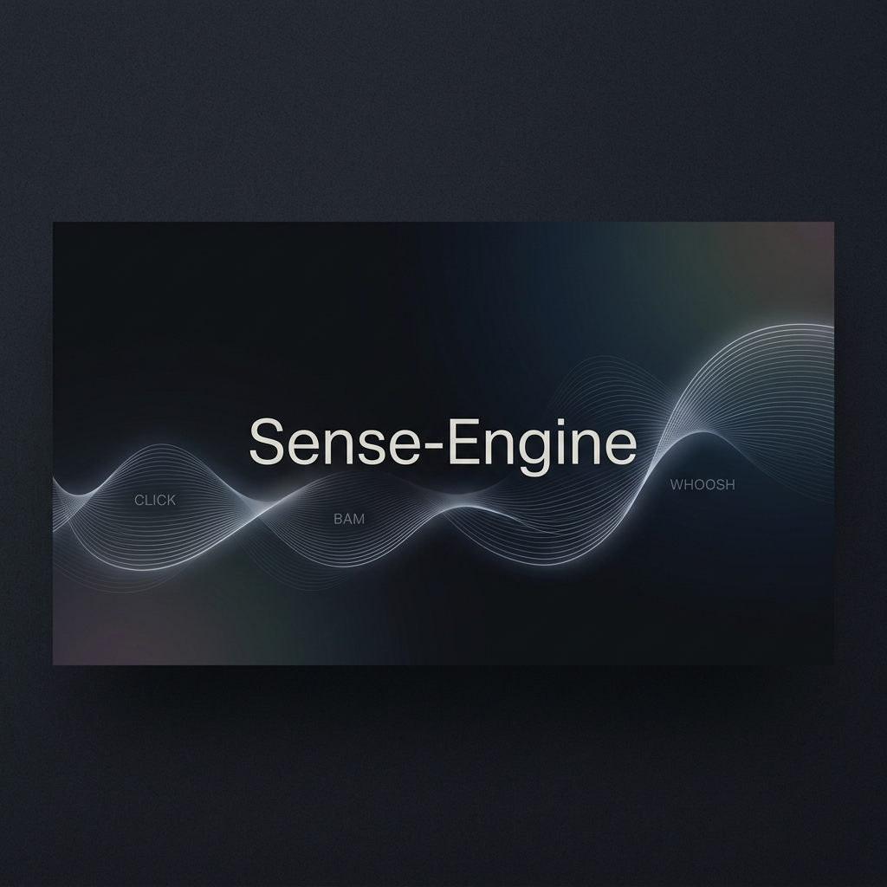

# SenseEngine.js



<div align="center">

[](https://opensource.org/licenses/MIT)
[](#)
[](#)
[](#)

**Motor de redundancia sensorial universal para aplicaciones web y videojuegos.**  
*Traduciendo el sonido en experiencias visuales inclusivas y precisas.*

[Español](#español) | [English](#english)

</div>

---

<a name="español"></a>
## 🚀 Descripción General

**SenseEngine.js** es un motor ligero diseñado para cerrar la brecha de accesibilidad en entornos interactivos. Su función principal es interceptar eventos lógicos (sonidos, impactos, acciones) y traducirlos en **onomatopeyas visuales dinámicas** con alta precisión lingüística.

### ✨ Características Principales

- **🎯 Mapeo de Precisión:** Traducciones exactas y fijas para cada tipo de evento, evitando ambigüedades.
- **🌍 Motor Multi-idioma (19 Idiomas):** Soporte nativo desde Español e Inglés hasta Japonés, Maorí, Suajili, Coreano y sistemas de escritura **RTL** como Árabe.
- **🫧 Bubble System (BETA):** Nuevo módulo para generar globos de cómic dinámicos y adaptativos (100% CSS puro). [Ver Documentación](./DOCS/README-BUBBLE-es.md).
- **🎨 Sistema de "Natures" (Skins):** Más de 20 estilos visuales combinables (fuego, agua, impacto, etc.) implementados puramente en CSS para máximo rendimiento.
- **🔊 Síntesis de Voz Integrada:** Soporte opcional para `Web Speech API`, permitiendo una experiencia auditiva complementaria.
- **♿ Accesibilidad Nativa:** Diseñado con estándares ARIA para ser amigable con lectores de pantalla.
- **⚡ Ultra-ligero:** El núcleo completo (JS + CSS) pesa menos de **1MB**, sin dependencias externas.

---

## 🛠️ Estructura del Proyecto

```text
Sense-Engine/
├── 🧪 index.html        # Laboratorio de pruebas y sandbox
├── 🎨 src/
│   ├── sense-engine.js  # Lógica central del motor
│   └── sense-engine.css # Sistema de estilos y animaciones
├── 📖 DOCS/             # Documentación técnica detallada
│   ├── LEXICON-MASTER-ES.md# Tabla maestra de idiomas
│   └── ...              # Guías de API e i18n
└── 🤖 llms.txt          # Documentación optimizada para IA
```

---

## 💻 Uso Básico

Integrar SenseEngine es extremadamente sencillo:

```javascript
// Inicializar el motor en un contenedor específico
SenseEngine.init('game-container');

// Configurar el idioma
SenseEngine.setLanguage('es');

// Disparar un evento visual
// (Evento, Coordenada X, Coordenada Y, Estilo/Nature)
SenseEngine.spawn('explosion', 400, 300, 'ono-fire');
```

---

<a name="english"></a>
## 🌐 English Summary

**SenseEngine.js** is a lightweight sensory redundancy engine that translates logical sound events into precise visual onomatopoeias. It is designed for developers who prioritize accessibility and performance.

- **Zero Dependencies:** Pure Vanilla JS and CSS.
- **Global Reach:** 19 languages including RTL support.
- **Bubble System (BETA):** Dynamic comic/manga adaptive bubbles module. [See Docs](./DOCS/README-BUBBLE-en.md).
- **Performance First:** Heavy optimization for mobile and low-end devices (< 1MB).

---

## 📄 Licencia / License

Este proyecto está bajo la Licencia MIT. Consulta el archivo [LICENSE](./LICENCES) para más detalles.

---

<div align="center">
Desarrollado por <b>Emanuel Appolonia</b>
</div>
